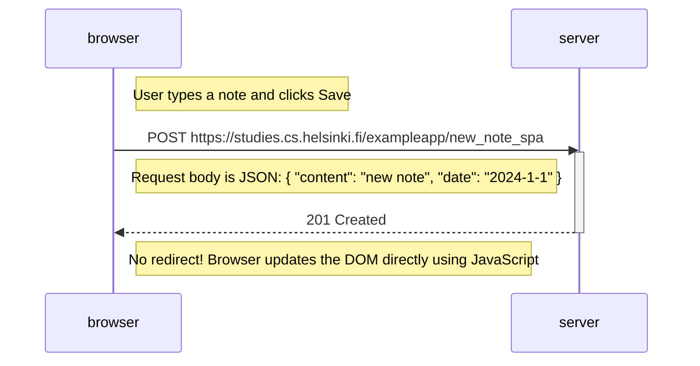

```mermaid
sequenceDiagram
    participant browser
    participant server

    Note right of browser: User types a note and clicks Save

    browser->>server: POST https://studies.cs.helsinki.fi/exampleapp/new_note_spa
    activate server
    Note right of browser: Request body is JSON: { "content": "new note", "date": "2024-1-1" }
    server-->>browser: 201 Created
    deactivate server

    Note right of browser: No redirect! Browser updates the DOM directly using JavaScript
```
